# Quadros do filme da home

Dezesseis quadros de início e fim das oito cenas, com fundo branco, elementos pretos, vidro líquido transparente e linhas rainbow. A direção visual segue o [roteiro da landing](../LANDING_PAGE_BRIEF.md).

As imagens são referências de composição para a produção do filme. Texto da home, marca, botões, código e rótulos de disponibilidade entram como HTML sobreposto. As linhas coloridas representam o percurso a animar; estes arquivos são imagens estáticas.

## Galeria por cena

| Cena | Início | Fim |
|---|---|---|
| 1 Entrada dos arquivos |  | 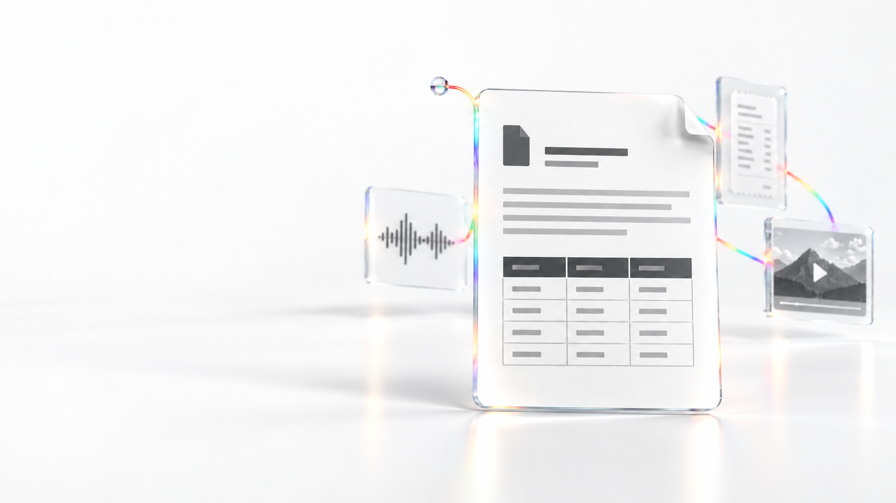 |
| 2 Documento em Markdown | 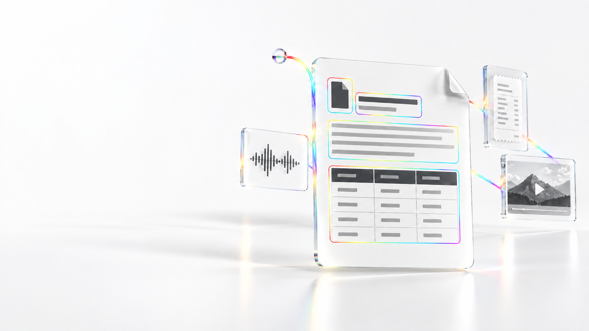 | 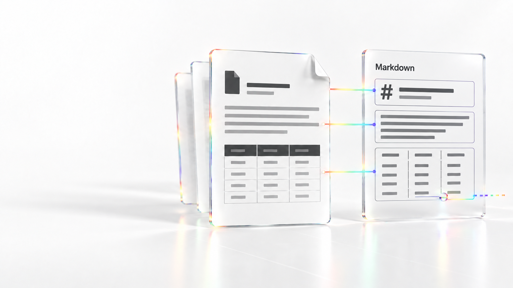 |
| 3 Áudio em transcrição | 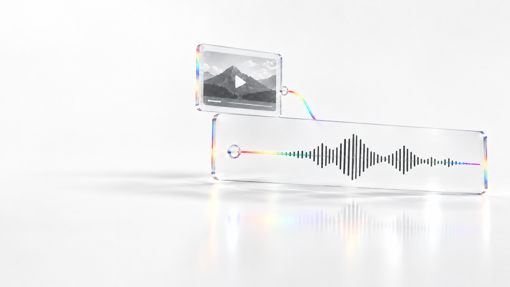 | 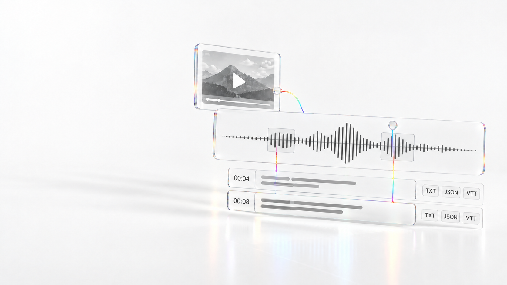 |
| 4 Imagem em texto | 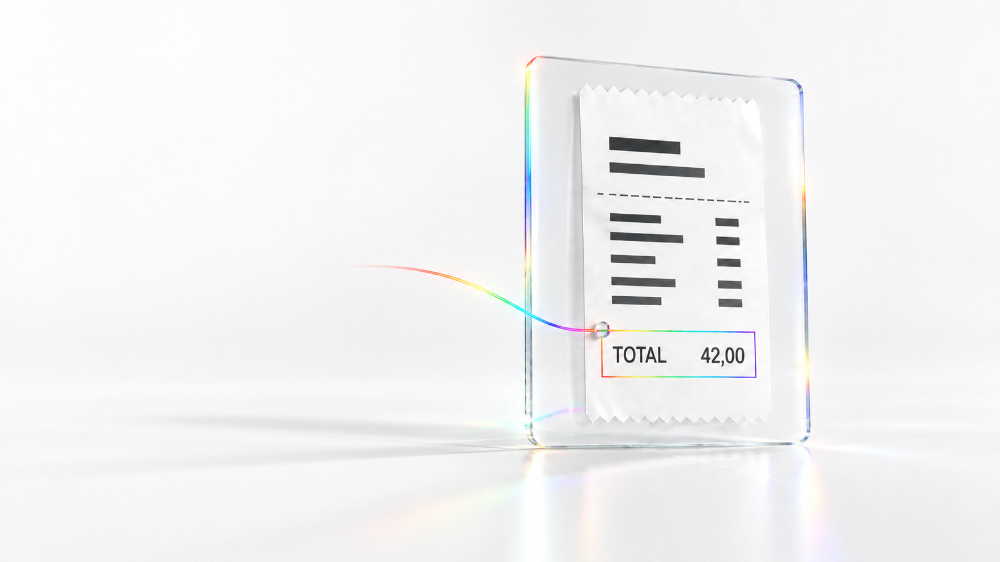 | 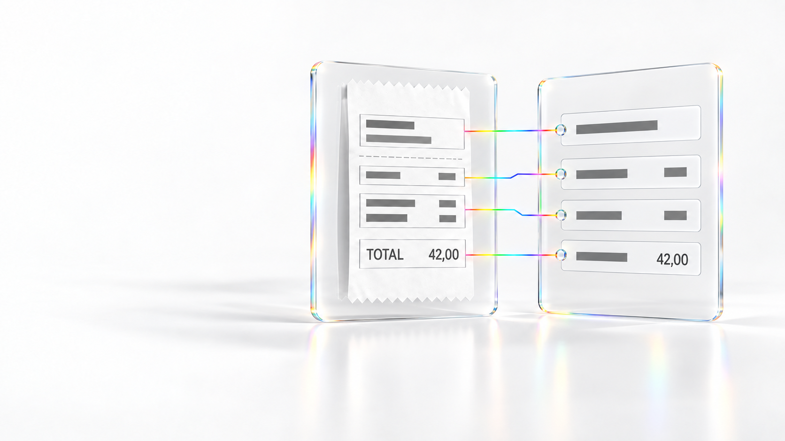 |
| 5 Execução local e Modal | 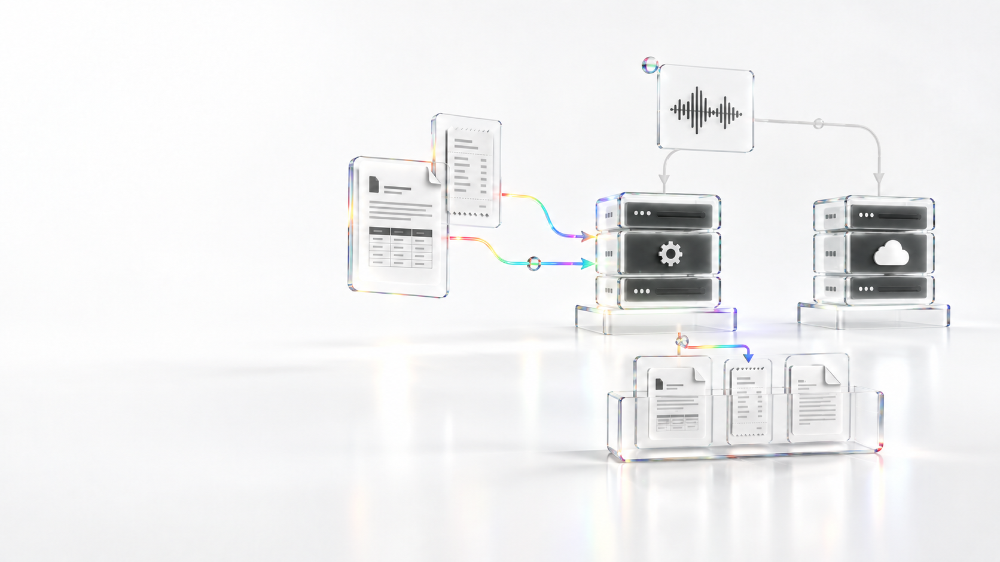 | 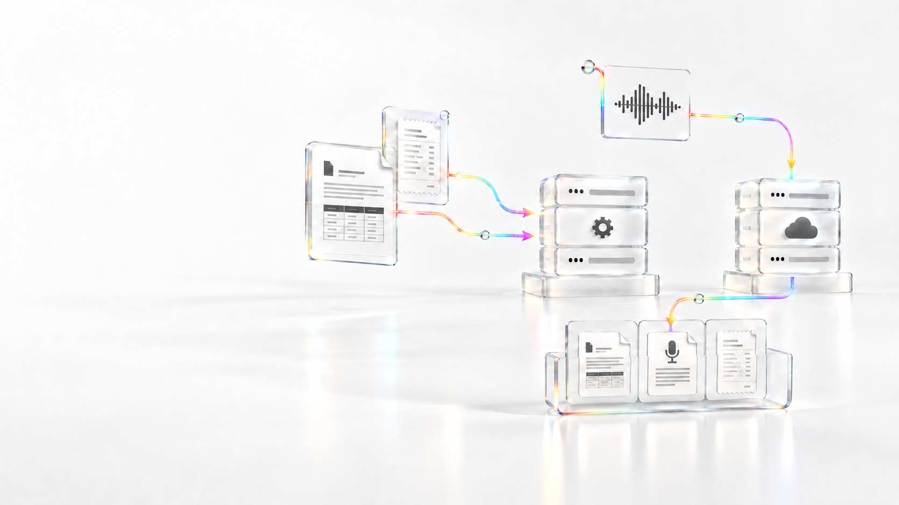 |
| 6 Organização e API | 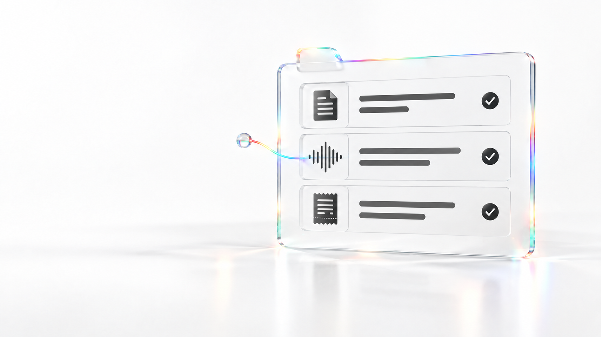 | 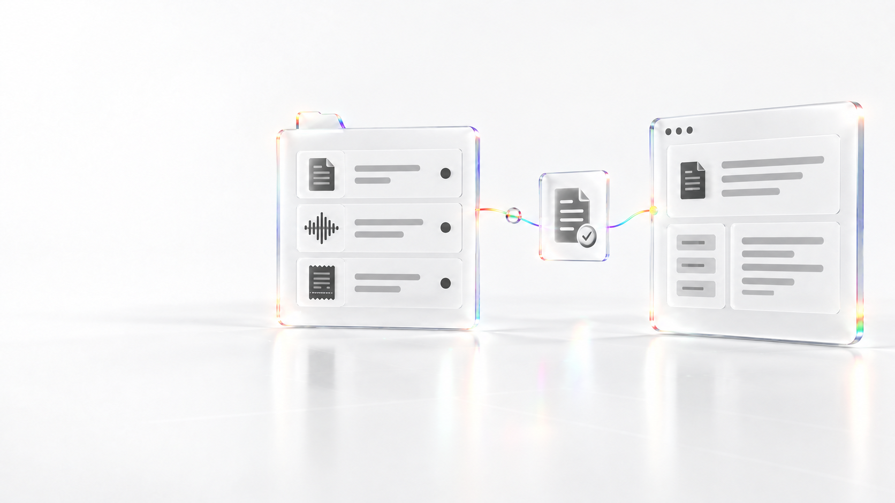 |
| 7 Evolução distribuída |  | 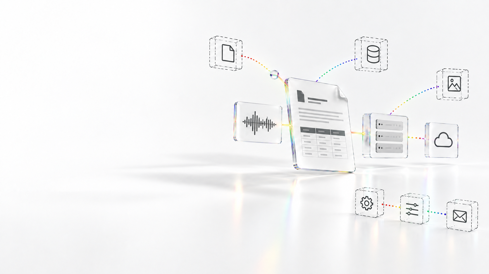 |
| 8 Encerramento |  | 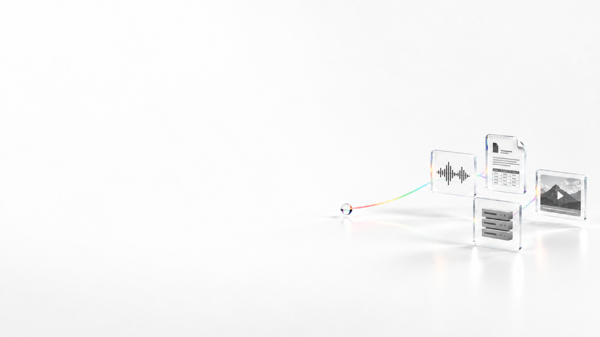 |

## Arquivos e produção

- Cópia solicitada: `/data/tmp/ingestify/white-rainbow/`.
- Arquivos versionados: `frontend/public/landing/storyboard/white-rainbow/`.
- Caminhos no frontend: `/landing/storyboard/white-rainbow/scene-01-start.png` e demais caminhos do manifesto.
- Geração e edição: ferramenta integrada `image_gen.imagegen`, pela skill `imagegen`.
- [Prompts completos e referências](image-prompts.json).
- O quadro final da cena 5 usa `scene-05-end-v2.png`, com o caminho de áudio exclusivamente ligado ao destino remoto.

Preserve a leitura de origem e resultado ao animar. A ligação entre cenas exige os movimentos de câmera e as transições descritos no roteiro; não faça apenas cortes secos entre estes quadros. A cena 7 precisa do rótulo HTML “Visão de evolução”, e o encerramento precisa do estado “Ver no GitHub”.

A versão horizontal desta galeria não substitui a futura composição vertical nem constitui um vídeo pronto. Os estudos escuros anteriores e a primeira versão do fim da cena 5 continuam na pasta local de trabalho, fora da seleção versionada.
