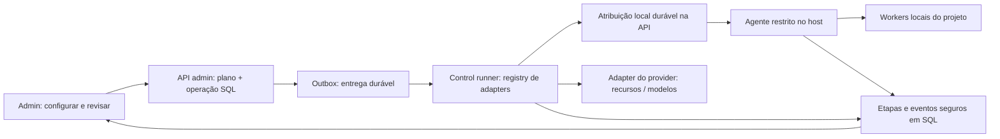

# 0007 — Operar engines e modelos pelo painel admin

| | |
|---|---|
| **Status** | Em implementação |
| **Autor** | Geda Valentim / Codex |
| **Criada em** | 2026-10-06 |
| **Atualizada em** | 2026-10-06 |
| **Relacionadas** | [0003](0003-motores-de-execucao-roteamento-e-orcamento.md), [0005](0005-transcricao-ao-vivo.md), [0006](0006-whisperx-e-identificacao-de-falantes.md) |
| **Substituída por** | — |

### Estado desta entrega

O código inicial entra em `main` com `ENGINE_CONTROL_ENABLED=false`. API, UI,
operações SQL, outbox, agente local e adapters local/Modal foram acrescentados;
as telas e os comandos Docker existentes permanecem disponíveis.
Os critérios abaixo continuam em aberto até a qualificação física no host e no
Modal. Esta entrega não declara toda a spec implementada.

Habilitar exige executar `scripts/migrate_0007_engine_control.py` no ambiente
Python da instalação, registrar o host com `scripts/register_engine_host.py`
(manifests efetivos, imagens e UUIDs), instalar o serviço systemd e montar o
arquivo de identidades na API. O overlay `docker-compose.engine-control.yml`
acrescenta um runner e um watchdog independentes. Todos os workers de conteúdo
gerenciados precisam receber a configuração de controle para que a admissão e
a drenagem sejam respeitadas; preservar a escala, os overlays e os dispositivos
reais da instalação durante o bootstrap.

O catálogo inicial controla os modelos já existentes. Perfis WhisperX de
controle ainda não foram qualificados: esses engines recusam alteração de
runtime com `WHISPERX_CONTROL_PROFILE_NOT_QUALIFIED`, preservando os caminhos de
execução da spec 0006. Custos pagos incertos mantêm a reserva; recovery consulta
o estado observado sem repetir efeitos externos. Pools pagos, standby/wakeup,
benchmark pela UI e os gates completos de operação continuam sujeitos às etapas
de implementação e qualificação descritas nesta spec.

## 1. Problema

`/admin/engines` mostra configuração e comandos, mas o operador precisa abrir um
terminal para deployar o Modal, escalar réplicas locais ou mudar o modelo de um
worker. Salvar `workers=3` não inicia três processos; ativar um engine não aquece
o modelo; pausar colocação não para containers. Falhas e saída do CLI não ficam
associadas à ação solicitada na tela.

A spec 0003 escolheu deliberadamente UI de leitura e operação externa. Esta spec
evolui essa decisão para edição e execução pelo painel, incluindo workers locais,
Modal, modelos, warmup e cooldown. Não redefine o ledger de jobs da 0003.
O contrato deve receber outros adapters (AWS, GCP, Vast AI) sem recriar API,
operações, auditoria ou telas para cada provedor.

### O que existe hoje, verificado no código

| Área | Reusar | O que falta |
|---|---|---|
| Edição/admin | `api/engine_admin_routes.py`: binding, GPUs, orçamento, credenciais, activate/pause, test, reconcile; `shared/engines/store.py`: validação, versão e auditoria | Formulários no front; configuração de runtime/modelo e operações duráveis |
| UI | `frontend/app/admin/engines/{page,[id]/page}.tsx`, `computeApi`, tipos e `components/admin/{compute-ui,engine-views}.tsx` | Ações, revisão de alterações, desejado/aplicado/observado e histórico |
| Deploy Modal | `workers/engines/modal_deploy.py`: plan/deploy, ambiente isolado, meta/fingerprint; `modal_apps/{fingerprint,image,whisper_app}.py` | Plano congelado, callback de etapas, saída progressiva; hoje `capture_output=True` só retorna no fim |
| Execução/custo | `remote_tasks.py`, adapter Modal, `ledger.py`, `budget.py`, `pricing.py`, `benchmark.py`, sweeper | Contabilidade de warm pool e operações, sem duplicar a cobrança dos jobs |
| Local | `features.py`: serviço/fila; `capacity.py`: binding e VRAM; heartbeat; Compose GPU/live | Executor restrito no host, drenagem de todos os caminhos, modelo efetivamente carregado e controle de processos |
| Modelos | Factory áudio/visão, `whisper_core.load_model`, loader live; modelos Modal fixos em `protocol.py` | Catálogo de perfis, revisão aplicada e readiness por processo; um heartbeat atual não prova warmup |

Nem tudo depende de CLI: as mutações rápidas já têm API. Deploy e controle físico
continuam faltando. Os endpoints atuais de test/reconcile aguardam Celery por
30/90 segundos e podem devolver 504 enquanto a ação ainda executa.

## 2. Objetivo

Permitir que um admin configure e opere engines, workers e modelos pela UI,
acompanhando etapas, logs seguros, custo e estado real até a conclusão, inclusive
após fechar a página ou reiniciar um executor.

### Fora de escopo

- Terminal livre, SSH arbitrário, execução de comandos/Compose/env enviados pelo navegador.
- Administração de banco, Redis, MinIO, Elasticsearch, API, tunnel ou host inteiro.
- Novo scheduler de jobs, migração WhisperX ou captura live no Modal: continuam
  nos contratos das specs relacionadas. O painel só expõe capacidades implementadas.
- Provisionamento inicial de Docker, certificados do agente, chaves privadas e
  aceitação de termos dos modelos. Feito uma vez pelo operador da instalação;
  a operação diária dos recursos gerenciados deve funcionar pelo front.
- Implementação dos adapters AWS/GCP/Vast AI nesta entrega. A extensão é parte
  do desenho e será validada com adapter de contrato, sem prometer suporte real.

## 3. Critérios de aceitação

- [ ] CA1. Admin edita GPUs, workers, concorrência permitida, orçamento,
  credenciais, rotas e perfil de modelo com validação/versão existentes;
  cadastro de conexão remota usa schema do adapter e pode ser feito no front,
  sem importar TOML para o Modal.
- [ ] CA2. A tela distingue desejado, aplicado e observado: `3 desejados / 2 vivos
  / 1 com modelo pronto`; salvar nunca é apresentado como deploy ou escala concluída.
- [ ] CA3. Subir, drenar/parar, reiniciar, escalar, deployar, aquecer e liberar
  modelos são operações tipadas com histórico e feedback. Nenhuma ação diária
  suportada termina exigindo copiar um comando; capability ausente informa a causa.
- [ ] CA4. HTTP aceita operação em até 2 s em ambiente saudável; build/warmup de
  minutos continuam assíncronos. Reabrir a página retoma snapshot e eventos sem repetir a ação.
- [ ] CA5. Sucesso de deploy exige identidade/protocolo/fingerprint conferidos;
  sucesso de warmup exige modelo/revisão corretos e inferência sintética no processo real.
- [ ] CA6. Reduzir escala, trocar modelo ou parar drena jobs, páginas e sessões
  afetados, incluindo trabalho local sem rota. O padrão nunca mata trabalho em voo.
- [ ] CA7. Dois admins ou uma redelivery não geram dois deploys/escalas. Plano
  obsoleto é rejeitado; executor antigo não publica sucesso após perder sua lease.
- [ ] CA8. Warm pool remoto tem prazo e teto financeiro, libera reserva ao
  esfriar e deixa de ser mantido ao expirar. Logs e eventos não carregam segredos.
- [ ] CA9. Host agent indisponível, GPU inadequada ou readiness desconhecida
  impedem confirmação de sucesso; UI mostra dependência/erro e mantém último aplicado.
- [ ] CA10. A implementação entrega local e Modal, com confirmação observada,
  catálogo de modelos e política de warm/cooldown. Entregar apenas formulários
  que salvam o binding não atende esta spec.
- [ ] CA11. Registrar um terceiro adapter de teste com campos, capacidades,
  identidade de recurso, custo e semântica de stop diferentes funciona pela API,
  pelo executor e na UI genérica, sem condicionais AWS/GCP/Vast no componente.

## 4. Solução proposta

### 4.1 Configuração e operações

Mutações rápidas usam os serviços de domínio atuais. Operações demoradas usam um
registro próprio `EngineOperation`, separado de `Job` e de `EngineUsage`:



Tipos: `test`, `reconcile`, `deploy`, `start`, `drain_stop`, `restart`, `scale`,
`warmup`, `cooldown`, `apply_profile`, `benchmark`. Todos têm schema fechado,
capability por adapter/feature e preview com efeitos, dependências e custos.
`pause_placement` e `activate` continuam usando o contrato atual; parar processo
é uma ação diferente. Nenhum tipo aceita campo `command` ou argumentos livres.

### 4.1.1 Contrato de adapter, antes dos provedores

Ampliar o registry de executors existente (`workers/engines/executors.py`) com uma faceta
`EngineControlAdapter`, mantendo o contrato de execução de jobs separado. Um
provider pode implementar ambas; um backend de instâncias pode inicialmente
provisionar workers que usam o protocolo local, sem fingir ter `transcribe()`
remoto. O registry é único e resolve `(adapter_type, adapter_version)`; API e UI
não importam SDKs de cloud. Local também implementa esse contrato, usando o agente.

Hoje o registry de execução resolve apenas `adapter_type`; factory remota,
lista `/admin/engine-adapters`, limites e schemas de credenciais ainda têm casos
fixos local/Modal. Extrair seus descriptors para o registry compartilhado,
preservando handlers e compatibilidade das entradas atuais. Versionamento e
faceta de controle são acréscimos: não existem prontos no código. Módulos de
descrição usados pela API não importam implementações/SDKs dos executores.

Descriptor distingue `execution_mode` (fila gerenciada ou runner remoto),
`control_scope`, `data_location`/fronteira de confiança e unidades de capacidade
e custo. Prover VM que executa Celery não torna o dado local nem autoriza acesso
ao conteúdo automaticamente. Eliminar inferências `adapter_type != local` nos
pontos de extensão de routing/dispatch/dispatcher/capacity/remote factory;
fila, privacidade, remote threads e pricing derivam dessas capabilities. Reusar
as validações de destino da 0003, sem transformar registry em bypass de admissão.

| Método | Contrato |
|---|---|
| `describe()` | Schema versionado de conexão/configuração, catálogo de recursos e actions, limits e semântica de lifecycle |
| `resource_keys(target, profile)` | Identidades canônicas de conta/projeto/region/resource para exclusão mútua entre engines |
| `validate(profile, context)` | Campos, compatibilidade de modelo, recursos/licença e limites do provider |
| `plan(action, desired, observed, context)` | Plano imutável, etapas, drain set, efeitos/custo/deadlines, verificação exigida |
| `apply(plan, control_context)` | Executa usando operation ID/generation, deadline, callbacks de etapa/log e handles externos duráveis |
| `observe(target, handles)` | Snapshot normalizado com revision/readiness/instâncias, fatos específicos e timestamp |
| `reconcile(operation, observed)` | Reconhecer efeito após crash; retomar, terminar ou indicar incerteza sem repetir automaticamente |
| `cancel(operation, context)` | Cancelamento cooperativo com resultado e efeitos residuais; não promete reversão automática |
| `estimate_cost()` / `reconcile_cost()` | Reserva e custos tipados compatíveis com ledger/budget, sem fórmula Modal imposta aos demais |

Capabilities descrevem suporte por feature, `scale_unit` (container, worker ou
instância), scope de parada, drain/force, warmup/readiness, ajuste dinâmico ou
redeploy, controle de modelo e custos. A ação normalizada pode resultar em
etapas diferentes; um provider que só permite stop destrutivo deve explicitá-lo
na revisão do plano. Não emular capacidade ausente com shell genérico.

Perfil usa termos comuns: `desired_replicas`, `max_replicas`, `min_ready_replicas`,
`idle_timeout_seconds`, `warm_until`, `model_profile_id`, CPU/memória/dispositivo.
O binding atual continua a representar capacidade de **execução**, distinta de
VMs e de processos vivos. `provider_settings` é um objeto fechado validado pelo
schema do adapter; não é um saco de env vars/kwargs. Modal traduz o perfil para
seu autoscaler; providers de VM podem precisar criar instâncias e iniciar workers.
Tabela de compatibilidade deve informar quais campos comuns exigem redeploy.

Credenciais continuam seladas/write-only: nomes/formato/máscara vêm do adapter,
não do tuple `token_id/token_secret` do Modal. Autenticação por identidade de
máquina/IAM, quando disponível, é capability alternativa a segredo estático;
nenhum segredo é transportado no plano/eventos. Resolver autoridade e localização
do executor por adapter/target, mantendo privilégios mínimos e SDK fora da API.

A UI renderiza um subconjunto aprovado de controles declarativos (select,
número, texto, segredo), sem HTML/JS ou URLs de submissão vindos do provider.
Adapters distribuem código e schemas como parte de releases revisadas; não são
plugins de Python carregados pelo navegador. Resultado específico fica em
`provider_details` validado/sanitizado; estados/ações/progresso são comuns.

| Adapter | Tradução prevista, sujeita à implementação futura |
|---|---|
| Local | Projeto/serviços/GPUs registrados → agente no host; escala de processos |
| Modal | Workspace/environment/app/runner → deployment e autoscaler de containers |
| AWS | Conta/region/alvo aprovado → adapter futuro de instâncias ou serviço gerenciado; não tratar todo AWS como um único tipo de VM |
| GCP | Projeto/location/alvo aprovado → adapter futuro com identidade e lifecycle próprios |
| Vast AI | Conta/alvo aprovado → adapter futuro de instância/alocação; disponibilidade e custo precisam de observação |

AWS/GCP/Vast são exemplos de extensão, não capabilities habilitadas. Um adapter
falso de instâncias validará diferenças (stop preserva/discarda disco, scale unit,
auth e custos) sem depender de chamadas ou de contas desses provedores.

### 4.2 Experiência em `/admin/engines/{id}`

As telas existentes e os exemplos de comandos Docker permanecem disponíveis,
conforme orientação do operador. Os controles do painel são acrescentados a
elas; manter esses exemplos não substitui a execução das ações suportadas pela UI.

Abas **Visão geral**, **Configuração**, **Modelos**, **Operações**. Na lista,
status e operação atual; ações menos frequentes ficam no menu de cada engine.

1. Editar um formulário com campos por capability: GPU/UUID, workers, execuções
   por worker, CPU/memória, perfil de modelo e warm/cooldown. Mostrar VRAM estimada
   e compartilhamentos de serviço, como Docling e áudio no worker genérico.
   Para engines gerenciados, esses campos criam revisão desejada via
   `runtime-profile`, sem chamar PUT de binding efetivo antes da operação.
2. **Revisar alterações** mostra diff, plano, trabalhos afetados, custo máximo,
   necessidade de drenagem/redeploy/restart e tempo limite. Campos secretos são
   write-only, enviados somente ao endpoint de credenciais existente.
3. **Aplicar** cria uma operação; painel lateral mostra etapas e console filtrado.
   Etapas sem medida de progresso mostram duração/spinner, sem porcentagem inventada.
4. Ao concluir, mostrar resultado observado, divergências e links para histórico.
   Falha mantém diff para corrigir e criar um novo plano; não faz replay automático.

Botões: **Iniciar**, **Pausar novas colocações**, **Drenar e parar**, **Reiniciar**,
**Aplicar escala**, **Deploy**, **Aquecer**, **Liberar modelo**, **Testar**,
**Reconciliar gasto**, **Benchmark**. Rótulos/capabilities especificam o alcance.
Fechar console desconecta somente a visualização; parar operação exige ação própria.

### 4.3 Perfis e estado real

`EngineRuntimeProfile` contém revisões imutáveis por `(engine, feature)`:
`revision`, adapter/schema version, binding validado, `model_profile_id`, runtime
policy e provider settings validados, hash do plano
e referência do artifact aprovado. Uma única revisão é aplicada por lane; trocar
modelo cria outra revisão. O scheduler continua lendo o binding efetivo em
`Engine.config`; durante aplicação usa a capacidade conservadora da transição.
Rascunho não modifica esse binding. Publicar o aplicado usa CAS/lock e auditoria.

Compatibilidade explícita: o PUT de binding atual altera `Engine.config` de
imediato. Em engine gerenciado, alterações que mudem recursos/runtime retornam
409 `RUNTIME_OPERATION_REQUIRED` com o fluxo de perfil/plano; não viram aplicação
silenciosa ou request assíncrono com resposta antiga. Instalações legadas mantêm
o comportamento atual, indicado na UI. O serviço interno de publicação reutiliza
validação/store/audit após drenagem e verificação, sem atravessar esse guard.
Declarações de GPU, rotas, credenciais, orçamento e activate/pause conservam os
endpoints rápidos, mas participam dos locks/versões e invalidam planos afetados;
declaração de hardware não significa pinning aplicado. Edição conflitante com
operação ativa é recusada, evitando bypass pelo endpoint legado ou pelo CLI.

`GET /admin/model-profiles` retorna catálogo versionado de perfis aprovados:
provider/backend, IDs/revisões dos pesos, imagem/lockfile, dispositivos e GPUs,
footprint, features, fixture sintética de warmup, gates e licença/acesso requeridos.
O admin escolhe perfis e parâmetros expostos; não envia Python, URL arbitrária,
repo com `trust_remote_code` ou caminho do host. Perfil indisponível/experimental
é explicado na UI. Os bloqueios de produção de dependências continuam valendo.

Footprint/capacidade derivam do perfil qualificado (pesos/backend/precisão/device),
não só do default global atual em `footprint_gb`. Reusar o cálculo de VRAM com
essa entrada versionada e margem de execução/sobreposição. Perfil sem footprint
qualificado não habilita aplicação GPU; override numérico não substitui essa gate.

Local: a revisão vira configuração tipada do serviço gerenciado, aplicada por
overlay gerado pelo agente, sem sobrescrever `.env`/Compose do operador. Ajustar
`gpu_ref` implica pinning real por UUID/dispositivo. Factories existentes carregam
o perfil no processo de execução; heartbeat novo informa perfil/revisão, device,
incarnation, PID, fila, `loading|warming|ready|draining|cold|failed` e observação.
Warmup de Celery deve atingir os filhos que executarão tasks, não apenas o parent.
Processo vivo, health HTTP e modelo pronto são estados distintos.

Modal: modelo hoje fixo em `protocol.py` passa a ser resolvido do perfil aprovado
no deploy spec, imagem, runner, meta e fingerprint. Reusar a imagem/loader;
não criar outro app por operação. Per-engine runtime status vem de consulta ao
provider + readiness do runner, com `observed_at`; falha de consulta é unknown.

### 4.4 Executor local no host

Novo `engine-host-agent`, serviço systemd independente dos workers gerenciados.
Registro inicial define host, projeto Compose, manifests aprovados, serviços,
imagens por digest, GPUs e capacidades. Ele consulta operações atribuídas por
endpoints internos autenticados com mTLS/identidade de máquina; não tem JWT admin
nem credenciais de conteúdo, SQL ou Modal. Redeploy do worker remoto pode ser
feito por ele mesmo que `worker-remote` esteja parado.

Somente o agente acessa Docker no host. Esse acesso é privilegiado e parte da
fronteira de confiança; não existe promessa de que o socket é seguro só por estar
em outro processo. API/frontend/Celery de conteúdo não recebem esse socket.
O agente valida novamente alvo, projeto, artifact, perfil e ação contra registro
local. Nenhuma resposta do servidor pode habilitar serviços, mounts privilegiados,
env ou imagens fora desse registro. Comandos são construídos em argv fixo, sem shell.

Alvos iniciais: `worker`, `worker-audio`, `worker-vision`, `worker-live`;
`worker-dispatch`/`worker-remote` podem iniciar/reiniciar, com restrições para não
remover controle durante operação ativa. Se o agente faltar, informar bootstrap
necessário; após instalado não exigir CLI para essas operações. O plano usa os
overlays GPU/live/produção efetivos, project name e hashes cadastrados, não um
`docker compose up` no cwd arbitrário. Reconciliação detecta edição manual/drift.

### 4.5 Drenagem, concorrência e aplicação

Cada plano deriva um **conjunto de recursos** via `adapter.resource_keys`: conta/app Modal, lanes locais,
serviços compartilhados, GPUs e sessões live. Locks de operação abrangem esse
conjunto; não basta bloquear apenas o engine/feature se duas ações mudam o mesmo
serviço. A identidade Modal inclui workspace/environment/app, inclusive se duas
linhas `Engine` usarem a mesma conta. Travar nunca mantém transação SQL aberta
durante build, subprocesso, espera de jobs ou chamada remota.

Além do lock temporário, recurso canônico tem um proprietário de controle e
revisão/política autoritativas persistentes. Engines que apontam ao mesmo app,
serviço ou pool são aliases desse recurso; não mantêm desejos independentes nem
reconcilers que alternem overrides. Transferência de propriedade exige plano e
drain quando afetar trabalho. Perfil por feature compõe a revisão do serviço
compartilhado; alteração mostra todos os engines/lanes afetados antes de aplicar.

`store._check_version` hoje compara um objeto ORM carregado; isso não é CAS SQL.
Todos os writers gerenciados, inclusive API/CLI, publicação de deployment e
resultados de test/reconcile, usam row lock ou `UPDATE ... WHERE version=expected`,
com ordem única de locks por recurso. Conflito é detectado antes do efeito externo.
Observações/heartbeats têm sequência própria; não incrementam versão de
configuração nem invalidam um plano só por atualizar freshness.

Drenagem põe gate durável antes de observar atividade: dispatcher/claim recusam
novas colocações; todas as entradas locais diretas e tarefas antigas consultam o
gate antes de iniciar a feature. Consumers afetados param de obter tarefas novas;
prefetch/reservados/ativos e tarefas sem `EngineUsage` também entram no inventário.
Para `/images/*`, bloquear nova execução e contabilizar a existente. Para live,
recusar novo POST e aguardar sessões/leases existentes. O ledger continua fonte
de custo; inventário de processos complementa tarefas não roteadas.

Consulta seguida de início não é barreira suficiente: gate e aquisição de ticket
durável de admissão por recurso são serializados sob a mesma exclusão SQL, antes
da execução/publicação. Usar claim/lease existente quando houver `EngineUsage`;
imagens, live e caminhos legados registram ticket equivalente. Fechar admissão, contar
em voo e confirmar drenagem usa essa mesma barreira, sem intervalo TOCTOU.
Tickets saem em `finally` e por reconciliação de processo/lease; TTL vencido sozinho
não prova que o trabalho acabou. Fallback/watchdog e retries respeitam o gate;
em modo gerenciado, falha em consultar a barreira impede iniciar, inclusive nos
caminhos que hoje recorrem ao fluxo direto após erro de roteamento.

Default de drenagem 15 min, configurável até 30 min. Timeout retorna `failed` com
`DRAIN_TIMEOUT`, preservando os processos/trabalhos e informando estado residual.
Cancelamento forçado é outra operação com confirmação específica, lista dos
trabalhos e efeitos no ledger/leases. Escala abaixo do em voo aguarda drenagem;
escala acima respeita VRAM de workloads simultâneos, não apenas do modelo novo.

Timeout/cancel antes de modificar runtime restaura admissão/consumers do aplicado
anterior, após verificar que ele continua íntegro. Após efeito incerto, mantém
gate/locks com motivo visível e recuperação por reconcile; não reabre por TTL
nem deixa o operador acreditar que uma operação terminal liberou o recurso.

Troca/redeploy: congelar plano → drenar → aplicar → verificar → publicar revisão
aplicada → liberar gate. Versão antiga e nova não recebem trabalho misturado.
O plano soma recursos durante sobreposição; se não couber, usa troca após drenar.
Falha não registra desired como applied. Rollback só usa artifact anterior
qualificado; pode falhar e deve mostrar os dois resultados. CLI existente também
respeita locks/gates e versão, para não furar uma operação iniciada pela UI.

### 4.6 Warmup e cooldown

Perfil declara `warmup_mode=on_start|manual`, `min_ready_replicas`, idle timeout,
prazo de manutenção e teto de gasto. Defaults não mantêm GPU remota paga ociosa.
**Aquecer agora** tem prazo explícito; **manter aquecido** tem expiração obrigatória,
máximo 24 h por plano renovável, com custo estimado/revisado e reserva sob lock.

Local: carregar e executar fixture sintética no mesmo processo/revisão; só então
`ready`. Cooldown drena e chama unload existente quando confiável (ex.: visão)
ou para/recria o processo para liberar contexto CUDA; verificar processo/VRAM
por alvo. Cache de pesos em disco não é apagado. Idle cooldown põe estado desejado
`standby`, não cria um loop em que reconciler reinicia o worker continuamente.
Demanda de fila em standby cria wakeup deduplicado; jobs aguardam readiness,
sem fallback CPU escondido. A política de shutdown/restore é aplicada no boot.

Modal: ampliar adapter para warmup/readiness e autoscaler do **mesmo** runner
deployado. `min_containers` mantém pool, `scaledown_window` controla o idle;
atualizações dinâmicas são resetadas em deploy e precisam ser reconciliadas.
Isso é documentado pelo [Modal](https://modal.com/docs/guide/scale), mas deve ser
qualificado na versão do SDK instalada, com `Cls`/environment reais. Não assumir
que uma chamada sintética aquece N containers; confirmar IDs distintos/revisão
e prontidão do pool, ou marcar operação como não verificada.

O fingerprint atual inclui `max_containers`/`scaledown_window`. Separar identidade
imutável de deployment (código, imagem, pesos, protocolo, recursos fixos) da revisão
de política dinâmica aplicada/observada; atualizar autoscaler não pode invalidar
o runner inteiro ou ser apresentado como deploy novo. Preservar leitura do
fingerprint legado até redeploy qualificado, com versão explícita do contrato.

Cooldown zera manutenção/buffer, drena e espera observação de escala para zero;
isso mantém o app deployado. **Parar deployment** é explícito: interromper um app
no Modal é destrutivo e voltar exige novo deploy, conforme a
[documentação do provider](https://modal.com/docs/guide/managing-deployments).
Não apresentar pause, cooldown e stop como sinônimos.

Warm pool/probes/builds usam a contabilidade da 0003 com novos tipos de custo
quando necessários. Reservar custo máximo da janela + margem; reconciliar gasto
sem contar duas vezes intervalos já cobrados aos jobs/idle tails. Reserva não é
teto da fatura do provider. Ao expirar prazo/orçamento, liberar manutenção, drenar
e verificar; se provider não responder, registrar `BUDGET_STOP_UNCONFIRMED`,
alertar e conservar exposição/reserva até reconciliar. Watchdog independente do
control runner desfaz overrides persistentes após crash, inclusive com zero jobs.

Pool pago vincula identidade da conta/alvo e versão selada de credencial ou
identidade de máquina usada para criá-lo. Rotação/remoção não pode eliminar o único
caminho de cleanup: drenar/verificar pools antes de remover a credencial antiga,
ou qualificar a substituta para o mesmo alvo e transferir esse vínculo. Endpoint
recusa remoção incompatível com `CLEANUP_CREDENTIAL_REQUIRED`; retenção da versão
antiga é restrita ao executor de cleanup e termina após confirmação. Revogação
externa é exposição não confirmada, com instrução de cleanup manual e alerta,
sem liberar reserva nem registrar cooldown bem-sucedido.

### 4.7 API e acompanhamento

Novos contratos exigem sessão JWT admin (`require_admin_session`), inclusive
leitura de logs operacionais. APIs de edição existentes permanecem; UI passa a
chamá-las. Modelo/profile/runtime são novos contratos tipados.

| Método | Rota (prefixo `/admin`) | Resultado |
|---|---|---|
| POST | `/engines` | Conexão criada pausada por schema de adapter; reutiliza importação/selagem/auditoria atuais |
| GET | `/engines/{id}/capabilities` | Ações/campos suportados, dependências, limites, motivos de bloqueio |
| GET | `/model-profiles` | Catálogo de perfis aprovados, sem segredos |
| GET / PUT | `/engines/{id}/runtime-profile` | Consultar/criar revisão desejada; versão obrigatória |
| GET | `/engines/{id}/runtime-status` | Applied/observed, instâncias/modelos, agente e freshness |
| POST | `/engines/{id}/operation-plans` | Preview congelado, sem efeitos externos, validade 5 min |
| POST | `/engines/{id}/operations` | Executar plano, 202 + `operation_id`; `Idempotency-Key` obrigatório |
| GET | `/engine-operations` | Histórico paginado por engine/estado/período |
| GET | `/engine-operations/{op}` | Snapshot, etapa, erro, can_cancel, estado residual e última sequência |
| GET | `/engine-operations/{op}/events?after=N` | Página de eventos duráveis; `next`, `has_more`, replay |
| GET | `/engine-operations/{op}/stream` | SSE autenticado, replay e heartbeat |
| POST | `/engine-operations/{op}/cancel` | Pedido de cancelamento cooperativo e resultado verificável |

```jsonc
// Plano: hashes de engine/profile/route/artifact/capabilities e conjunto de recursos
{"type":"apply_profile","feature":"transcription","engine_version":12,
 "profile_revision":3,"drain_timeout_seconds":900,"max_usd":"0.10"}
// Execução — header Idempotency-Key: UUID; segredo/senha nunca entra no plano
{"plan_id":"uuid","plan_hash":"sha256","confirm_paid_operation":true}
// 202
{"operation_id":"uuid","state":"queued","events_url":"/admin/engine-operations/uuid/events"}
// Evento durável, exemplo
{"seq":18,"type":"stage.changed","stage":"warming","at":"2026-10-06T12:00:00Z",
 "payload":{"ready_workers":1,"target_workers":2,"message":"Carregando o segundo modelo"}}
```

Erros: 403 sem sessão admin; 409 plano expirado/versão alterada/operação conflitante
ou `RUNTIME_OPERATION_REQUIRED`;
422 campo/capability/modelo/VRAM inválido; 503 dependência necessária indisponível.
Chave repetida + mesmo hash retorna a operação anterior; corpo diferente retorna
409. Durante execução, erro/deadline é estado da operação, não 504 de request.

SSE via `fetch` com bearer no header, não `EventSource` com token na query.
Replay pelo cursor, conexão ≤60 s renovável e rechecagem de sessão/admin a cada
30 s; não continua expondo logs após expiração/revogação. Timeout de proxy cai
para polling do mesmo cursor. Lento leitor não bloqueia executor. Progresso vem
de etapas estruturadas (`validating`, `draining`, `building`, `deploying`,
`starting`, `loading`, `warming`, `verifying`); logs não são fonte de estado.

### 4.8 Dados, recuperação e logs

Novas tabelas: profiles/revisões e ownership de recursos canônicos;
`engine_operation_plans`; `engine_operations`;
`engine_operation_resource_locks`; `engine_operation_events`; outbox; hosts
registrados + observações com timestamp. Migration explícita/reversível antes
de habilitar mutações. Downgrade recusa operações/warm pools ativos; preservar
auditoria/custos e desligar writers antes de remover tabelas.

Operation: actor/engine/tipo, snapshots sem segredos, plan hash, idempotency key,
state/stage, lease holder/generation/expiry, provider/app/call ou alvo de processo,
cancel_requested, deadline, result/error, created/started/finished. Estados:
`queued`, `running`, `reconciling`, `succeeded`, `failed`, `cancelled`,
`needs_attention`; recuperação usa `reconciling` enquanto o efeito externo não
puder ser comprovado. Estado terminal não implica liberar locks de efeito incerto.

Transação grava operação, locks e outbox; publicador entrega somente `operation_id`
à fila de controle dedicada, isolada de jobs e test/reconcile rápidos. Sweeper
republica **o mesmo ID**; claim SQL e generation cercam eventos e finalização.
SQL é a verdade. Redis apenas notifica mudanças; perder pubsub não perde replay.
Host agent claim/heartbeat/report passam por endpoints internos escopados a host,
operação e generation, com schemas de resultado validados.

Após crash, reconciliar identidade/app/processo antes de repetir efeito. Guardar
intenção antes da chamada e referência externa assim que conhecida; se não houver
prova suficiente de execução, `needs_attention`, sem novo deploy automático.
Cancelar subprocesso não prova rollback no provider. Cancelamento após commit
externo retorna resultado residual e oferece ação inversa explícita. Locks não
são liberados para outro writer até reconciliar/neutralizar executor anterior.

Reusar `modal_deploy.plan/deploy`, `benchmark` e tarefas atuais, extraindo somente
hooks de etapa, saída e identidade da operação. CLI vira outro cliente dessas
mesmas operações quando gerenciado, mantendo bootstrap/leitura. Evitar executar
`scripts/engines.py` recursivamente numa task que abre outra operação.

Console lê stdout/stderr por pipes progressivos limitados, sem `shell=True`.
Redação ocorre **antes** de persistir/publicar: segredos exatos registrados,
patterns atuais, linhas parciais, ANSI/control chars e buffers limitados. Limites
iniciais: 8 KiB/linha, 1 MiB de logs/operação, 10 eventos de log/s agregados;
marcador informa truncamento, etapas/resultados continuam preservados. Nada de
env dump, TOML, comandos com tokens, payloads de arquivos ou output bruto público.
Logs expiram em 7 dias; metadata/auditoria em 90 dias. URLs de provider são
permitidas apenas em hosts conhecidos, sem query/credenciais. Download de log
também requer sessão admin e só entrega a versão filtrada.

## 5. Alternativas consideradas

| Alternativa | Motivo da decisão |
|---|---|
| Formulários + comando para copiar | Reusa API, mas mantém dependência diária do terminal e não atende o objetivo |
| Shell/SSH/socket Docker dentro da API | Permissão de host junto à superfície web; não permite restringir o contrato às operações desejadas |
| Esperar CLI no request HTTP | Proxy pode expirar; refresh perde contexto e repetição pode duplicar efeitos |
| Só Redis/Celery result backend para histórico | Expiração/restart não fornecem estado durável nem reconciliam efeitos externos |
| Autoscaler Modal sem perfil persistido | Override desaparece no próximo deploy; UI e custo perdem correspondência |
| Criar scheduler/ledger novos | Duplicaria controles da 0003; acrescentar operação administrativa acima deles |

## 6. Impactos

Compatibilidade: 0007 evolui as exclusões de UI, prewarm e controle Docker da
0003; não declara as specs 0005/0006 implementadas. Endpoints atuais mantêm
contratos em modo legado; engines gerenciados aplicam o guard de runtime acima,
compartilhado pela API e CLI. Instalação
sem agente pode continuar em modo legado, identificado na tela, sem falsa promessa
de controle. Conclusão da funcionalidade exige gates de local **e** Modal.

Segurança: sessão/admin reconferidos no MySQL; senha recente nos fluxos de
credenciais já existentes. Operação paga ou forçada pede confirmação de efeitos
no próprio produto. Credenciais Modal continuam seladas e abertas apenas no
executor autorizado; agente local nunca as recebe. Builds usam sources/locks
aprovados; o navegador não escolhe código a executar.

Operação: fila/control runner e serviço host novos; logs e histórico bounded;
heartbeat/reconciliação periódicos. Métricas: duração por etapa, queued age,
locks presos, divergence, readiness, custo reservado, warm expiry e falha de
budget stop. Bootstrap/backup/rollback e overlays registrados terão runbook.

## 7. Plano de testes

- **Reuso/contratos:** regressões de capacidade, store/audit, admin auth/versão,
  secrets, deploy/fingerprint, benchmark, ledger, admission e routes existentes.
- **Extensão:** adapter falso de VM com schema/credential/custo diferentes,
  ações não suportadas, stop destrutivo e resource alias; UI sem novos `if`
  por provider e erros tipados iguais aos de local/Modal. Versão de schema
  desconhecida falha antes da operação, sem interpretar settings antigos.
- **Operações:** outbox após commit; falha ao publicar; redelivery; double click;
  duas contas/hosts/serviços compartilhados; plano stale; restart em cada etapa;
  generation antiga; cancel/deadline antes e depois do efeito externo.
- **Drenagem real:** MariaDB/Redis + workers: tasks roteadas, sem rota,
  prefetched/ativas, retry, imagens síncronas e sessões live. Nenhum trabalho
  novo começa após o gate; trabalho em voo termina antes da parada normal.
  Forçar corrida entre gate/claim e contador zero; indisponibilidade SQL não
  admite novo trabalho por fallback; TTL vencido com processo vivo não libera drain.
- **Host isolado:** projeto Docker descartável, overlays reais, escala 1→2→1,
  GPU UUID, modelo em processo filho, bootstrap com worker-remote parado;
  negar serviço/imagem/mount/env/comando não cadastrados e lease antiga.
- **Modal real com teto explícito:** deploy e meta, classe/ambiente correto,
  escala e drenagem, warm pool N IDs, expiração após matar o runner, cooldown
  a zero, stop/redeploy; registrar custo e observed, nunca inferir sucesso de exit 0.
  Executar job real após autoscale dinâmico sem falso `needs_redeploy`; rotação/
  remoção de credencial não impede cleanup de pool, inclusive após restart.
- **Modelos/VRAM:** cache/perfil correto por processo, falta de acesso/revisão,
  produção bloqueada quando gate não qualificado, unload/restart e VRAM durante
  sobreposição; processo com heartbeat mas modelo errado nunca conta ready.
- **Eventos/logs:** replay após reconnect/TTL Redis, leitor lento, proxy timeout,
  sessão revogada, logs secretos divididos entre chunks e limites/truncamento.
- **Chromium:** configurar → preview → executar → observar → fechar/reabrir;
  desired/applied/observed; erro e ação inversa; console em desktop/mobile com
  autoscroll opt-out. Fluxos completos sem CLI após bootstrap.

## 8. Plano de implementação

- [ ] 1. Contrato `EngineControlAdapter`, registry/versionamento, adapter de teste
  e capabilities; schemas e UI para mutações
  rápidas, cadastro remoto e rotas. Sem sinalizar controle de processos como pronto.
- [ ] 2. Migration, plans/outbox/operation/events, locks, recuperação e polling/SSE;
  integrar test/reconcile; preservar endpoints síncronos legados.
- [ ] 3. Deploy Modal pelo executor comum com log progressivo, perfil/fingerprint,
  versão, drenagem, cancelamento e recuperação; qualificação remota real.
- [ ] 4. Agent local/registro/systemd, overlays tipados, guards de todas as lanes;
  start/stop/restart/scale e integração de processo/readiness.
- [ ] 5. Catálogo/model profiles, warmup/unload, min warm/idle/expiry e contabilidade;
  watchdog independente, reconciliação Modal e demanda local em standby.
- [ ] 6. Benchmark pelo front com fixture aprovada e teto; UX integrada, gates
  Chromium/host/Modal, runbooks e rollout opt-in. Habilitar ações por capability
  qualificada, mantendo todas as fatias acima no escopo da entrega.

## 9. Questões e decisões

- [x] Feedback do CLI? → **Decisão:** etapas estruturadas e console filtrado com
  replay; CLI é executor possível, não contrato enviado pelo usuário.
- [x] Outros providers? → **Decisão:** lifecycle/configuração por faceta de
  adapter e UI guiada por capabilities; AWS/GCP/Vast não exigirão outro fluxo
  administrativo. Apenas local/Modal são implementados nesta entrega.
- [x] Escalar local sem socket na API? → **Decisão:** agente de host restrito,
  autenticado e independente; bootstrap de uma vez e uso diário pelo painel.
- [x] Warmup tem custo contínuo? → **Decisão:** prazo, reserva e watchdog obrigatórios;
  pools pagos permanentes sem expiração não são aceitos neste contrato.
- [ ] Qualificação SDK Modal para pool/readiness/stop: executar spike na versão
  instalada e documentar recursos do provider. Limitação não reduz o escopo da
  funcionalidade; exige adapter/contrato verificado antes de habilitar o botão.
- [x] Revisões independentes de arquitetura/reuso e operação/segurança concluídas
  em 2026-10-06, com rechecagem após correções e sem bloqueantes restantes.
  Correções: registry real e descriptors genéricos; desired separado de binding;
  CAS SQL em todos os writers; admissão atômica/fail-closed; ownership e recuperação
  de gates; footprint por perfil; fingerprint separado da política dinâmica;
  credencial de cleanup preservada até desligamento pago confirmado.
  Scheduler, ledger, loaders e deploy existentes continuam sendo reutilizados.
